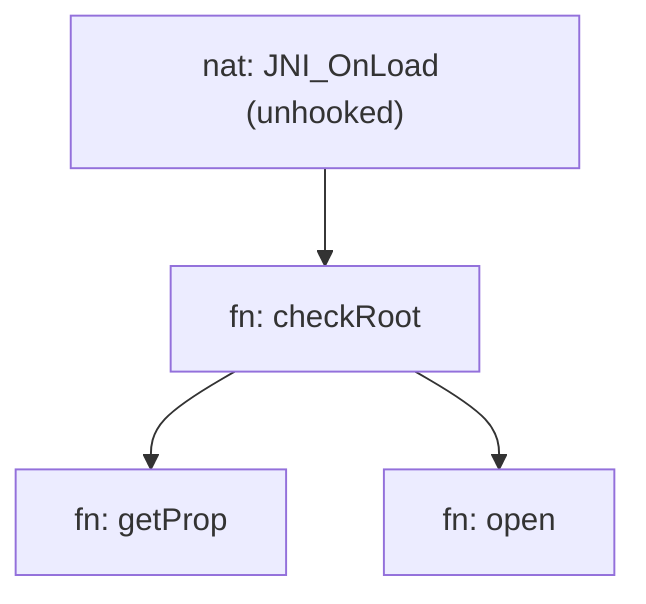
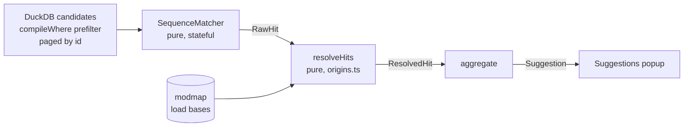
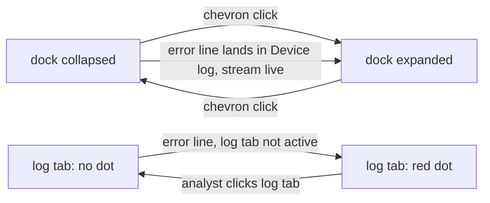
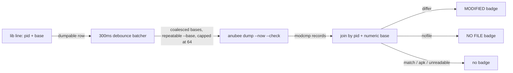
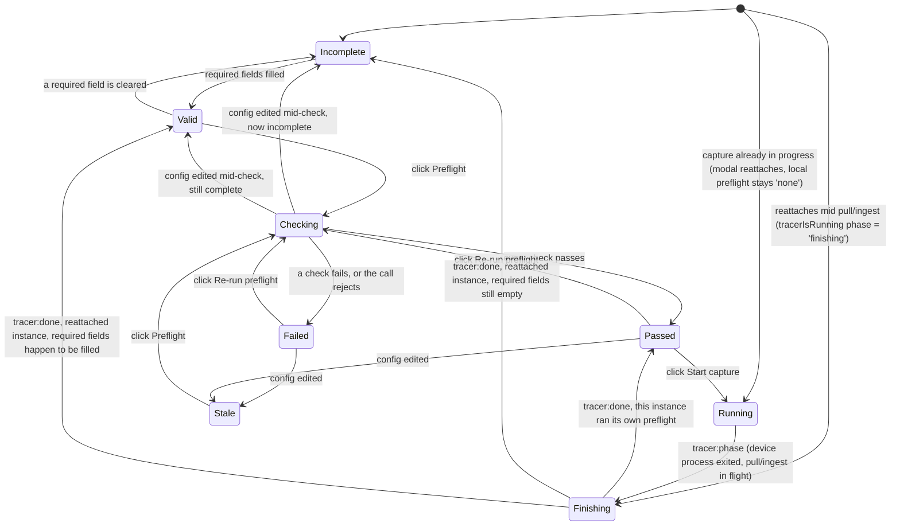

# Anubee-Desktop - technical documentation

Technical breakdown of the app, per feature. Kept current on confirmed change.

## How it works

Offline-first: you load a saved Anubee JSONL run. The run is ingested into an
embedded **DuckDB** store in the app's main process - raw records stay in the
database, off the JS heap, so multi-GB runs don't blow up memory. Navigation is
through a filterable **master table**; selecting a bridge of interest renders its
**focused syscall→native→Java subgraph**. The app never draws a whole run at once:
a graph slice is filtered and capped before it reaches the renderer.

- **Data tier** - DuckDB in the main process (`@duckdb/node-api`). `read_json`
  ingest; SQL answers the master table, a capped graph slice, and raw records by
  id. The ingest schema and queries are ported from the Anubee host-side DuckDB
  store (`../Anubee/tools/anubee-mcp`); no Python runtime is bundled.
- **Render tier** - a master table for the full run, then cytoscape.js + ELK
  (layout in a Web Worker) for the focused subgraph. An over-large slice is
  truncated with a prompt to narrow the filter, never drawn as a hairball.
- **Pure logic** - Electron-free, unit-tested modules own the event schema, the
  backtrace-symbol grammar, and the node/edge identity rules.

## Limitations (Phase 1)

- **Offline only** - loads a saved JSONL file; no live streaming, no on-device
  capture yet (tracer control and live view are later phases).
- **Focused views, not a whole-run graph** - you reach a subgraph by filtering the
  table and selecting a row. A whole-run overview (supernode aggregation) is
  deferred; the flame-graph view (below) covers the call-depth axis instead.
- **Rendered slices are capped** - an over-large graph slice is truncated with a
  prompt to narrow the filter, rather than drawn as an unreadable hairball.
- **Input contract is Anubee JSONL output only** - the app parses Anubee's output
  schema; it never builds against Anubee source.

### Graph node legend

The focused subgraph draws a small always-visible legend in the bottom-left of
the graph pane (`#legend` in `index.html`): a green diamond for a java method, a
blue dot for a native symbol, a red square for a syscall - the same shape/color
coding used on the nodes themselves and reused verbatim by the flame view's
`KIND_FILL` map (`src/renderer/flame-view.ts`) so the two views read as one
system.

### Graph empty-state and node labels

- **Empty-state prompt.** When a run is loaded but no table row or graph node
  is selected yet, the graph pane shows a dedicated `#graph-empty` prompt
  ("Pick a row to trace its call chain", with a sub-line pointing at the
  table) instead of a blank canvas - distinct from the earlier "no run loaded"
  empty state, which only covers the pre-load case. It hides as soon as a
  selection renders a slice, and is re-shown on `onLoaded` for a freshly
  loaded run before anything is selected.
- **Node kind-glyph prefix.** Every graph node label is prefixed with a small
  glyph for its kind (`kindGlyph` in `src/renderer/graph-view.ts`): `◆` for
  java, `●` for native, `■` for syscall or func. This gives each node a
  legend-independent visual cue even before checking color, useful once a
  slice has many same-colored nodes close together.
- **Coverage/truncation chip.** The `#banner` element is now a quiet chip
  pinned to the graph pane's top-right corner rather than a banner spanning
  the pane - and it is gated to appear **only after a row/node is selected**,
  fixing the earlier behavior where a load-time banner could overlap the
  empty-state prompt. It carries whichever message currently applies: the
  slice-truncation warning when the rendered subgraph hit `GRAPH_SLICE_CAP`,
  or (once a run's coverage health resolves via `window.anubee.coverage`) a
  chip built by `coverageChipText` (`src/renderer/coverage-chip.ts`) -
  truncation text prefixes the coverage text when both apply. `CoverageEvent`
  has three shapes (see its comment in `src/shared/events.ts`): **exempt**
  (an engine with no coverage surface, e.g. `lib`/`dump`) shows the reason;
  **clean** (no degradation signal fired, including any run captured without
  `--snapshot`) shows a plain "full coverage" line; **degraded** composes
  whichever of snaps/CFI-walks/drops/etc actually fired. A record with
  nothing to report renders no chip at all rather than a misleading zero.


## Funcs engine support

The app loads both `anubee syscalls` and `anubee funcs` output. A run's engine is
detected at ingest from the record types present (`RunInfo.kinds`); the left
panel and graph adapt automatically. A funcs run traces native function
entry/exit via uprobes: each hooked call emits a `call` record (entry, args,
backtrace) and a `return` record (retval, `elapsed_ns`) that **share one `id`**
(a monotonic per-call span counter the tracer emits on both).

- **Funcs list.** For a funcs run the master table lists one row per `call`,
  with columns `function` (`module!symbol`), `caller` (the immediate native
  frame, offset stripped), `retval`, `elapsed`, and `args`. retval/elapsed are
  folded from the matching `return` by a deterministic join on the shared `id`
  (`GraphStore.table()`), so recursion and reentrancy pair correctly; a call
  with no return shows blank. `return` records are not listed.

- **Funcs call graph.** Selecting a row draws a **deep, unified
  function-to-function call graph**, built entirely in SQL (`FUNCS_CHAIN_SQL`)
  and verified against the pure-TS oracle `foldFuncEvents` by a lockstep test.
  The chain is the whole reversed backtrace (plus reversed `java_stack` when a
  capture carries it). Managed frames collapse by method: the ART bytecode
  offset (`+0x<dexpc>`) is stripped from `java:` ids exactly as native call-sites
  collapse by their dropped `+0x<off>`, so one managed method is one node whether
  it was AOT-compiled (no offset) or interpreted (carries a dexpc). A backtrace
  frame whose `module!symbol` is itself a
  hooked function collapses into that function's own `fn:` node (unify), so a
  function appears once whether it is a leaf or a caller; unhooked intermediate
  frames stay `nat:` scaffold nodes. Nodes reuse the `func` kind (gold) in the
  same visual language as the syscall graph.



Funcs and syscall graphs share common `nat:` native nodes by identity, so a
mixed `trace` run (both engines) renders one organic native call graph rather
than two disconnected islands. Funcs chains, list, and count all carry the
`span IS NULL` guard, so span-tagged correlate rows never leak in.

- **Funcs record inspector.** Clicking a funcs graph node lists the `call`
  records whose chain touches it (`# · caller · retval · elapsed · args`), paged
  in windows of 100 with the same prev/next pager as the syscall inspector;
  clicking a list row - or a master-table row - opens that record's full detail
  (function, tid, caller, retval, `elapsed_ns`, then `args`, `string_args`,
  `fd_args`, `sock_args`, `out_args`, and the backtrace). A displayed record is
  the `call` row merged with `retval`/`elapsed_ns`/`out_args` from its paired
  `return` (shared `id`), joined in SQL by `GraphStore.eventById` / `nodeEvents`
  (engine-routed, bounded, `span IS NULL`). The ghidra offset popup is
  syscall-only for now, so node-tap skips it on a funcs run.

## UI shell

The chrome is a left **icon rail** (`#rail`, `src/renderer/index.html`) plus a
single **command bar** (`#cmdbar`) above the body - replacing the earlier
chrome-bar + File-dropdown + segmented switch + separate filter bar.

- **Rail.** Collapsed to 46px (icon-only); hovering the rail expands it to
  ~172px, revealing a text label (`.lbl`) beside each icon (CSS opacity
  transition, no layout-triggering resize of the rest of the shell - the rail
  overlays). Icons are inline `<svg><use href="#i-...">` references into a
  single `<defs>` block at the top of `index.html` - no emoji anywhere in the
  shell. Items are grouped by a `.rail-div` divider into three zones:
  - **view** - Graph / Flame (`#tab-graph` / `#tab-flame`); the active view
    gets an accent left-border bar and accent text color (`.rail-item.on`).
  - **tools** - Suggestions, Rules, Diff, Capture; each opens its panel/modal.
  - **file** - Open (JSONL), Export, Log.

  A `.rail-grow` spacer pushes a bottom-pinned **theme toggle** to the foot of
  the rail. The native Electron menu stays removed (`Menu.setApplicationMenu(null)`
  in `src/main/index.ts`); the old File ▾ dropdown's **Quit** entry was dropped
  from the UI (the `app:quit` IPC handler still exists but nothing in the
  renderer calls it) - closing the window, or Ctrl+Q, still quits.

- **Command bar.** `#cmdbar` sits to the right of the rail and holds a single
  **omni filter** input (`#f-text`, `src/renderer/index.html`) - no separate
  syscall/library/tid fields, checkbox, or Apply button. Typing a `key:value`
  word (dotted namespace, keys below; a quoted value like `syscall:"open at"`
  keeps spaces intact) turns it into a removable chip on space or Enter; Enter
  also applies the current chips plus whatever free text remains. A chip's `×`
  removes it and re-applies. Backspace in an empty input pops the last chip
  back into editable `key:value` text. A key-name autocomplete dropdown opens
  on a partial key prefix (`ArrowUp`/`ArrowDown` to move, `Enter`/`Tab` to
  accept, `Escape` to dismiss) - it suggests key names only, never values.
  Grammar and chip-folding live in `src/shared/omni-parse.ts` (`splitWords`,
  `matchToken`, `filterFromParts`); the DOM wiring is
  `src/renderer/filter-controls.ts`. Free text (anything left after chips are
  pulled out) searches the syscall name, java and native stack frames, and
  every arg field - `args`, `string_args`, `fd_args`, `decoded_args`,
  `sock_args`, `out_args` - plus the scalar `sock_addr` field (a `connect`
  record's socket destination, e.g. the Frida abstract socket `@/frida-...`),
  via the `ILIKE` fragment in `filterToSql`
  (`src/shared/filter.ts`). Limits: one value per key (a second `tid:` chip
  replaces the first, not OR's with it), key-name autocomplete only (no value
  suggestions from the loaded run's data), and no negation or regex grammar.
  This replaces the old two-tier chrome-bar-plus-filter-bar layout, and the
  earlier explicit-fields-plus-Apply-button command bar, with one row.

  **Filter keys:**

  | key | matches |
  |---|---|
  | `syscall:<sub>` | syscall name substring |
  | `tid:<int>` | exact thread id |
  | `id:<N>` / `id:<A-B>` | exact record id, or an inclusive id range |
  | `java.exist:true\|false` | record has / lacks a non-empty Java stack |
  | `java.method:<sub>` | a Java-stack method substring |
  | `stack.lib:<sub>` | any native backtrace frame's library substring |
  | `stack.sym:<sub>` | any native backtrace frame's symbol substring |
  | `fn.lib:<sub>` | funcs-engine resolved callee library substring (funcs runs only) |
  | `fn.sym:<sub>` | funcs-engine resolved callee function substring (funcs runs only) |
  | `tag.exist:true\|false` | record reaches / does not reach any confirmed-tagged node |
  | `tag.name:<category>` | record reaches a node tagged with that RASP category - `root`, `debugger`, `emulator`, `integrity`, `hook`, or `custom` |

  **Renamed keys** (hard rename, no aliases): `lib:` -> `stack.lib:`,
  `module:` -> `fn.lib:`, `symbol:` -> `fn.sym:`, `java:` -> `java.exist:`.
  Typing one of the old keys no longer matches a filter - it falls through to
  free text instead.

  `tag.exist:`/`tag.name:` currently match only `sys:`/`nat:`/`java:` node
  targets recorded on a confirmed tag; edge (`edge:src=>dst`) and funcs-callee
  (`fn:`) tag targets are not yet matched per record (see `BACKLOG.md`).

- **Modals.** Export and Diff now open as modals from their rail buttons
  (`#export-btn`, `#diff-btn`), joining Capture, Rules, and Suggestions as
  **centered modal overlays** (shared `src/renderer/modal.ts` component) that
  do not consume side-panel space; the table and graph stay visible behind the
  modal, dismissed by an explicit Close button or by clicking outside. An empty
  state is shown in place of the body until a run is loaded.

  The action modals (**Open**, **Export**, **Diff**) present their choices as a
  shared **`.modal-menu`** of full-width icon rows - a leading inline-SVG glyph
  plus a left-aligned label - built by the `modalMenuItem(id, iconId, label)`
  helper, so all three read as one consistent menu rather than a loose cluster
  of buttons. The **Diff** modal's **Mode** filter (`all` / only-in-A /
  only-in-B / tagged) is a *post-load* view filter over the comparison result:
  it has no meaning until a run B is loaded, so it is not rendered until the
  compare-load succeeds (`addDiffModeField`), and re-opening Diff while a run B
  is still loaded shows it immediately.

### Activity log (rail Log button)

Every user **action** is recorded to an in-memory activity log - run load, export,
capture + streamed tracer output, rule updates, tag edits, preflight - each an
entry with a level (`info` / `success` / `warn` / `error`). Read-queries (table,
graph slice, node records) are not logged. The rail's **Log** button opens a modal with a
scrollable, color-coded monospace **terminal box** that live-appends while open
(auto-scrolling when pinned to the bottom) and renders entry text with
`textContent` only (tracer output is untrusted). **Save** writes the buffer to a
chosen `anubee_<YYYYMMDD>_<HHMMSS>.log` file via a native save dialog; **Clear**
empties it. The log is the source of truth for process outcomes: it replaced the
old always-visible status pill (removed). The pure `src/renderer/log-store.ts`
(ring-capped at 5000 entries) is the single state owner; `src/renderer/run-logged.ts`
wraps each action to log success/error; `src/renderer/log-view.ts` renders the modal.

**Ingest progress** (formerly on the status pill) now shows as a thin progress bar
on the **empty-state** during a run's first load, driven by the tracer/ingest
`onProgress` events and hidden once the run loads.

### Master table and detail panels

The body is split into a left **master table** and a right **detail panel**, both
conditionally visible:

- **Master table** appears only after a run is loaded. It displays all events
  matching the current filter, paginated at 500 rows per page with a header pager
  (`‹ from–to / total ›`) to step prev/next over the full result - the pager
  header carries the page window and the filtered total. Applying a filter or
  loading/switching a run resets to page 1.

- **Detail panel** appears only when a record or graph node is selected. It has
  two modes:
  - **Row selection:** clicking a master-table row opens a single-record detail
    (Summary / Args / Java stack / Backtrace) AND still redraws the middle graph
    slice to reflect that row's subgraph.
  - **Graph-node selection:** clicking a graph node opens the records-behind-node
    list (unchanged from earlier phases).

The detail panel is dismissed via an explicit X button in its header; the master
table is collapsed/expanded via a floating square button at the table's right edge
(or far left when collapsed).

### Master table columns

The master table's columns are **configurable**, engine-aware, and rows render
at a uniform **40px** height (`#table td { height:40px; vertical-align:middle }`)
regardless of how many lines a cell's content stacks internally.

- **Stacked call-site cell (default mode).** Both engines default to a single
  merged `call site` column (`renderCallSite` in `src/renderer/table.ts`)
  instead of separate top-java/top-native (or function/caller) columns:
  - **syscall engine:** the Java leaf (`javaLeaf` - innermost `.`-segment of
    `java_stack[0]`, bytecode offset stripped) stacked over the native leaf
    (`nativeLeaf` - `module!symbol`, call-site `+0x<off>` stripped), joined by a
    `↳` arrow **only when both are present** (`.paired` class gates the
    `::before` arrow in CSS - an unpaired native-only row shows no arrow).
    Native-only (no Java frame) renders as a single native line. Neither
    present renders the literal `- no backtrace` in muted italic (`cs-none`).
  - **funcs engine:** the function leaf stacked over `◂ from <caller leaf>`;
    a call with no caller frame (a true root call) renders `- top frame`
    instead of the `◂ from` prefix (`cs-top` class suppresses the `::before`).
  - Every leaf span carries the **full original string** in its `title`
    attribute, so hovering a truncated leaf reveals the untruncated
    `module!symbol+0x...` or fully-qualified Java method.

- **Tag chips.** The `tags` column renders each RASP tag on the row's innermost
  native frame as its own small rounded **chip**, colored by category
  (`chip cat-root|hook|debugger|emulator|integrity|custom`) rather than a plain
  comma-separated badge string. Tags still key on the row's `topNative` frame
  only (offset dropped) - see the existing known-drawback entry in `BACKLOG.md`.

- **Funcs duration bar + red negative retval.** The funcs `elapsed` column
  shows the formatted duration (`formatDuration`: ns/µs/ms/s) plus a thin bar
  beneath it, proportional to the **current page's** max elapsed value; the
  row holding that max gets the `.hot` class (bar renders in the syscall/red
  accent color) so the hottest call on the visible page is instantly visible.
  A missing elapsed (call with no matching return) renders a plain em dash. The
  `retval` column colors a negative return value in the syscall/red accent
  (`.neg`) to flag an error return at a glance; a missing retval also renders
  an em dash.

- **Column picker + stacked/split toggle.** The `⚙ columns` button in the
  table header opens a modal driven by `columnCatalogue(engine, mode)`: a
  checkbox per column (with `id` locked on, shown with an inline SVG lock icon
  next to its row instead of just a disabled checkbox) plus a **stacked / split**
  segmented toggle. Split mode expands the merged call-site cell back into
  separate columns - `java?` / `top java` / `top native` for syscall runs,
  `function` / `caller` for funcs runs - for analysts who want each frame
  independently sortable/visible rather than stacked. Switching modes rebuilds
  the column set via `engineColumnKeys(engine, mode)` and re-renders. The
  resolved `ColumnLayout` (`{ columns, widths, callSite }`) persists to
  `localStorage` under `anubee.columns.<engine>` (`parseLayout`/`serializeLayout`
  in `src/renderer/columns.ts`), so a saved funcs layout and a saved syscall
  layout - including their call-site mode and widths - coexist and survive an
  app restart. A bare legacy `anubee.columns` array (pre-dating this layout
  model) is still parsed and migrated to `{ columns, widths: {}, callSite:
  'stacked' }`.

- **Opt-in `tid`/`retval` columns (syscall engine).** For the syscall engine,
  `tid` and `retval` are part of the column picker's catalogue (offered as
  checkboxes in both stacked and split mode) but are **off by default** - the
  default-visible column set omits them, and an analyst opts in explicitly via
  the picker (`SYSCALL_STACKED_CAT`/`SYSCALL_SPLIT_CAT` vs.
  `SYSCALL_STACKED_DEF`/`SYSCALL_SPLIT_DEF` in `src/renderer/columns.ts`). The
  choice persists in the same per-engine `ColumnLayout` as any other column.
  Funcs runs are unaffected: `retval` already ships in their default columns.

- **Per-column drag-resize.** Each `<th>` carries a `.col-grip` drag handle
  (`src/renderer/column-resize.ts` + `wireColGrips` in `main.ts`); dragging it
  resizes that column live via window-level pointer listeners (survives the
  pointer outrunning the small grip hit area, same pattern as the table/side
  panel resize). Width is clamped `48-640px` (`clampColWidth`). **Double-clicking**
  a grip drops that column's explicit width, letting it auto-fit back to its
  flex share. Widths persist per column key (not position) in the same
  per-engine `ColumnLayout.widths` map, so any subset/order of visible columns
  lays out correctly. The **last column is the flex remainder** and is not
  resizable (no grip drag/dblclick wired on it) - it absorbs whatever width the
  fixed/resized columns don't claim.

### Adjustable panels

The table and side (graph/flame/capture) regions are drag-resizable and
collapsible. Pure width math (`clampWidth`, `DEFAULT_LAYOUT`, `parseLayout`/
`serializeLayout`) lives in `src/renderer/panels.ts` and is unit-tested;
`wirePanels` does the DOM wiring in the renderer. Widths are held as CSS custom
properties (`--table-w` / `--side-w`), clamped to 160-760px, and resizing is
driven by **window-level** pointer listeners rather than listeners on the drag
handle itself, so a drag that outruns the handle (fast mouse movement) doesn't
drop the resize. The master table collapses/expands via a floating square button
positioned just outside the table's right edge (or far left when collapsed); the
right panel is dismissed via its header X button only (no collapse affordance).
Both the widths and the collapsed/expanded state persist to
`localStorage['anubee.layout']`, so the layout survives an app restart.

**Known limitation:** persistence is per-machine (`localStorage`), not
per-project - opening the same run on a different machine does not carry over
the saved layout.

### Theme

`src/renderer/theme.ts` defines a token-based theme system: CSS custom
properties with a dark default, toggled to light via the bottom-pinned theme
button in the left rail, persisted to `localStorage['anubee.theme']`. Critically, `theme.ts`
is the **single source** of the java/native/syscall (plus label-backing and
edge) colors - `applyGraphTheme` feeds them to cytoscape, the `#legend`, and
the flame view's `kindFill`, replacing the previously triplicated color
constants that had drifted across those three call sites. The graph's label
backing color switches with the theme so node labels stay legible against
both the dark and light canvas.

**Brand palette.** The chrome tokens map to the Anubee logo: an amber-gold
accent - `--accent` `#c9a24a` (dark) / `#b0812e` (light) - a warm near-black
*night* surface ramp (dark), and a *bone* `#F5F3EE` surface ramp (light),
replacing the earlier war-red accent. A companion `--accent-ink` token
(`#17140d`, same value both themes) is the text color for anything filled
solid with `--accent`: primary buttons (`.btn.pri`), the capture form's
numbered section badge (`.cap-n`), and the segmented-button active state
(call-site stacked/split toggle, Libraries Loaded/Live toggle) - the pale
`--accent-fg` tone used elsewhere for accent-colored text reads fine on the
surface background but loses contrast sitting on top of solid gold. The four
kind colors are reharmonized into a warm family that stays separable while
sitting under the accent: java sage, native slate-blue, syscall terracotta
(moved off pure red so it does not collide with the accent), func amber; the
RASP category colors follow the same warming - semantic colors (kind/RASP/warn)
are otherwise unchanged by the gold recolor. The rail brand mark (`.brand-logo`
in the left-rail `.brand` slot) renders the vendored `assets/logo.svg` as an
``, replacing the earlier inline-SVG `A`-mark path. The window/taskbar
icon is `build/icon.png` (electron-builder auto-detects it; `src/main` also
sets it on the dev `BrowserWindow` when present).

The bottom-pinned toggle (`#theme-toggle`) is **rail-aware**: while the left
rail is collapsed it shows a single `.theme-mini` glyph of the *current* theme
(moon in dark, sun in light), aligned with the other rail icons; hovering the
rail expands it and reveals the full sliding `.theme-pill` (moon + sun + knob)
and its label. `updateThemePill()` keeps both the pill's knob and the collapsed
mini glyph pointing at the active theme.

### Startup splash

On launch, `src/main/index.ts` opens a small frameless, transparent,
always-on-top `BrowserWindow` (`src/renderer/splash.html`, a second
electron-vite renderer entry alongside `index.html`) showing the logo, the
`ANUBEE` wordmark, and an indeterminate gold progress bar, while the main
window loads behind it. The main window stays hidden (`show: false`) until
its `ready-to-show` fires; the splash is then held for a minimum of ~600ms
from when it first appeared (`Math.max(0, 600 - elapsed)`) so a fast load
doesn't flash-and-vanish, after which the main window shows and the splash
closes. Setting `ANUBEE_NO_SPLASH` skips both the splash window and the
minimum-display wait, showing the main window immediately - used by the
screenshot harness and E2E runs so the first window Playwright attaches to
is the main window, not the splash.

**Limitation.** The splash's progress bar is a purely decorative CSS
animation (indeterminate) - it is not wired to real DuckDB ingest progress;
see `BACKLOG.md`.

### Graph zoom

A zoom cluster (`+` / `-` / fit) sits over the graph pane, driving `cy.zoom`
and `cy.fit` directly - there was previously no way to zoom the focused
subgraph other than the mouse wheel.

## Phase 2 - tagging, heuristics, findings export, run diffing

Phase 2 turns the read-only Phase 1 viewer into an annotation and comparison
tool, built on the same DuckDB data tier. Four features:

### Run-scoped store (multiple runs loaded at once)

The single DuckDB `ev` table gained a `run_id` column, and `GraphStore` keeps an
in-memory run registry (`RunInfo`: run id, source file, ingest timestamp, event
count) alongside an "active" run id. `ingest()` assigns each loaded file the
next run id and appends into the same table rather than replacing it, so a
second `Load run` call does not evict the first. Every query method (table,
slice, `nodeEvents`, `suggest`) defaults to the active (most-recently-loaded)
run when no run id is passed, so Phase 1 call sites keep working unmodified.
This run-scoping is what makes run diffing (below) possible without a second
DuckDB instance.

### RASP semantic tagging

An analyst marks a graph node (or a specific offset inside it) with what RASP
behavior it implements. A tag (`src/shared/project-store.ts`, type `Tag`) has:

- `target` - a graph node id: `nat:<mod>!<sym>` (native symbol), `java:<method>`,
  `sys:<name>` (syscall), or `edge:<src>=><target>`.
- `offset` (optional) - a block-level refinement: a bare module-relative offset,
  e.g. `0x1234` (or `[unmapped]` when the call site could not be resolved),
  chosen from a concrete backtrace frame in the node inspector when a symbol
  covers more than one basic block. It is deliberately *not* module-qualified,
  so a heuristic-confirmed offset and one authored from the offset popup are
  byte-identical and share one tag identity. Anything rendering an offset for a
  human (the findings export) has to pair it with the target to name the
  library and symbol.
- `category` - one of `root | debugger | emulator | integrity | hook | custom`.
- `source` - `manual` (analyst-authored) or `heuristic` (confirmed from a
  suggestion, see below), plus `confidence`/`rationale` when heuristic-sourced.

Tags persist to a sidecar file next to the loaded run, `<run>.anubee-desktop.json`
(`src/main/sidecar.ts`), so tagging survives across sessions without mutating
the trace itself. `project-store.ts` is pure (parse/validate/serialize/upsert -
no filesystem access); main reads and writes the file. A malformed sidecar
entry is dropped with a reported error rather than failing the whole load.
Identity for upsert/remove is `(target, offset, category)` - retagging the
same target at the same offset with the same category replaces, not
duplicates. `category` is part of identity because a single node can
implement several RASP behaviours at once (e.g. one obfuscated block that both
checks for a debugger and scans for hooks), and the same symbol can implement
different behaviours at different call sites - so a target/offset pair alone
is not enough to say which behaviour a tag is naming. The renderer exposes a tag editor in
the node inspector and shows tag badges on graph nodes plus a tag column in the
master table (`src/renderer/tag-view.ts`, `inspector.ts`).

### Orphaned tags

When a sidecar is loaded against a re-ingested run whose node ids have shifted
(symbol resolution differs, binary rebuilt), tags whose target no longer matches
any node/edge become orphans. `GraphStore.orphanTargets(targets, runId?)` reports
which targets are absent (node-id and edge-key sets built in main so only the tag
targets cross IPC); the pure `orphanedTags(tags, orphanSet)` selects them and the
renderer's Orphans panel lists each with a Drop / Drop all action. Orphans are
never dropped automatically - the analyst confirms.

### Heuristic pre-tagging (never auto-applied)

`src/shared/rasp-heuristics.ts` is a **rule-driven** engine, not a hardcoded
scorer. A `Rule` is data:

```
{ id, category, confidence, rationale, enabled,
  steps: [{ syscalls, field, op, argIndex?, value }, ...],  // >= 1
  correlate, maxGap, source }
```

A rule is a list of ordered **steps**, not a single predicate: a length-1
`steps` array is today's single-event predicate (unchanged from before), and a
longer array requires each step to match, in order, before the rule fires. A
two-step rule like `hook-frida-scan` (below) reads as "a maps walk, later
followed by a frida-artefact probe" - either step alone is weak evidence, the
sequence is what makes it a strong one.

`field` is one of the event's own shapes (`args`, `string_args`, `fd_args`,
`sock_addr`); `op` is a **fixed** operator vocabulary - `path_matches` (regex
against a path-like field), `equals`, `arg_hex_eq` (hex-normalized arg
comparison) - so a step is pure declarative matching, never user SQL or code.
That fixed vocabulary is the safety boundary: anyone (a project, a user
library) can add a rule, but no rule can execute arbitrary logic. In both
compilers (below), an `fd_args` value is normalised from the tracer's raw
`fd=<n> <path>` shape down to the bare path before matching - `normalizeFdValue`
in JS, the equivalent `regexp_extract` in SQL - so a rule author writes a path
pattern, never the fd-wrapped form. An fd whose `readlink` failed carries no
path (`fd=<n>` with nothing to unwrap) and contributes no value at all, rather
than matching the literal string.

**`correlate` and `maxGap`.** A multi-step rule needs to know which events
belong to the *same* occurrence - `correlate` picks the key: `symbol` /
`symbol+tid` key on the resolved graph target (the RASP call site, optionally
scoped to the thread), `module` / `module+tid` key on the native module the
call site lives in, and `java` keys on the innermost Java frame for a
managed-code check with no native anchor. `maxGap` bounds how far apart two
consecutive steps may land: it counts **rule-relevant events** - events that
match *some* step of *some* rule, i.e. exactly what the DuckDB prefilter below
admits onto the JS heap - sharing that correlation key, allowed between one
step matching and the next. An event that matches no rule step never reaches
the matcher and so never counts against any gap, no matter how much unrelated
work a thread does in between. Distance is measured in events at all, rather
than wall-clock time, because Anubee's syscall records carry no timestamp - a
time-based window is not something the tracer's output can support.

Two compilers consume the same rule set and are kept in lockstep by a
real-DuckDB integration test that checks them **per step**:

- `compileWhere(rules)` -> a bounded SQL `WHERE` clause (an OR of every rule's
  every step), used as a candidate pre-filter so `GraphStore.suggest(runId?)`
  only reconstructs genuine candidates onto the JS heap.
- `SequenceMatcher` -> a stateful JS class that walks the id-ordered candidate
  stream and is the **scoring authority**: it tracks in-flight partial matches
  per rule per correlation key, advances or expires them per event, and emits
  a `RawHit` when a rule's full step sequence completes. The SQL pre-filter is
  purely a bounded narrowing, never the source of truth for what matches.

Every hit is attributed to the innermost **non-system** native frame
(`targetOf`) - the app's own RASP block (e.g.
`base.apk -> libsentinel.so!sentinel_check_root`), skipping the bionic / ART /
framework wrappers; it falls back to the innermost **Java** frame when the
whole native path is system libs (a managed-code check with no custom native
lib to anchor on), and yields nothing at all for a stack that is entirely
platform code (no `Suggestion` row is produced for it). Resolved hits
(`resolveHits` in `src/shared/origins.ts`) are aggregated per **(target,
category)** pair (`aggregate()`: sums occurrences, keeps the highest-confidence
rationale, and folds each distinct call-site offset into a per-offset count)
into `Suggestion` rows and surfaced in a **Suggestions popup** opened from the
rail's Suggestions button (`src/renderer/suggestions-view.ts`); the right side
panel stays details-only. Each row is `(target, category)` with its call-site
offsets listed as expandable children. A suggestion is never turned into a tag
automatically:

- **row-level** Confirm/Reject acts on the whole `(target, category)` row -
  Confirm mints a `source: 'heuristic'` tag with no offset (covers every call
  site), Reject persists a row-level dismissal in the sidecar `dismissed` list.
- **call-site-level** Confirm/Reject acts on one offset child - Confirm mints a
  tag carrying that exact offset, Reject dismisses just that offset - so an
  analyst can accept one call site's finding while leaving siblings open.

Either action removes the acted-on row/child from the popup.



**Built-in rules** (`BUILTIN_RULES`). Every row below is a single step unless
noted; `hook-frida-scan` is the one built-in **sequence** rule (two steps,
matched in order on the same `module+tid`, up to 200 rule-relevant events
apart):

| id | syscalls | field / op / value | category | conf |
|---|---|---|---|---|
| `dbg-ptrace-attach` | ptrace | args / arg_hex_eq[0] / `0x10` | debugger | 0.7 |
| `dbg-ptrace-traceme` | ptrace | args / arg_hex_eq[0] / `0x0` | debugger | 0.9 |
| `dbg-status-open` | openat, newfstatat | string_args / path_matches / `/proc/self/status$` | debugger | 0.6 |
| `dbg-status-read` | read | fd_args / equals / `/proc/self/status` | debugger | 0.6 |
| `hook-maps` | openat, newfstatat | string_args / path_matches / `/proc/self/maps$` | hook | 0.4 |
| `hook-frida-sock` | connect | sock_addr / path_matches / `frida` | hook | 0.9 |
| `hook-frida-scan` | step 1: openat / string_args / path_matches / `/proc/self/maps$`; step 2: openat, newfstatat, faccessat, access, readlinkat / string_args / path_matches / `frida\|gum-js-loop\|re\.frida\|linjector` | hook | 0.95 |
| `root-paths` | openat, access, newfstatat, faccessat | string_args / path_matches / `su`, `magisk`, `busybox`, `/system/xbin`, `/sbin`, `/data/adb` | root | 0.85 |
| `root-selinux` | openat, newfstatat, faccessat | string_args / path_matches / `/sys/fs/selinux/enforce$` | root | 0.8 |
| `root-ksu-prctl` | prctl | args / arg_hex_eq[0] / `0xdeadbeef` | root | 0.9 |

`emulator` and `integrity` ship **no built-in rule** and are not
syscall-detectable: emulator checks are typically property reads
(`__system_property_get`, not a syscall), and integrity checks read the app's
own `base.apk`, which is indistinguishable from ordinary DEX/zip loading at the
syscall layer. Both remain valid `RaspCategory` values for manual tagging.

**Merge across scopes.** Rules resolve from three layers: `BUILTIN_RULES`, a
global library (`<userData>/rasp-rules.json`, `rasp-rules-store.ts`), and a
per-project override carried in the run's `<run>.anubee-desktop.json` sidecar.
`resolveRules` concatenates builtin -> global -> project and, on an `id`
collision, **later scope wins** (project overrides global overrides builtin).
`enabledOverrides` lets any scope enable/disable any rule by id under the same
later-scope-wins precedence, so a project can re-enable a rule a user has
globally disabled.

### RASP rule-authoring UI

A `#rules` floating panel (`src/renderer/rules-view.ts`, opened by the rail's
"Rules" button) lists `resolveRules`' effective set as **card rows** (aligned with
the Suggestions modal visual language), each displaying a category chip, source
`[builtin|global|project]` badge, rule id, a meta line (confidence + the first
step's syscalls), and a predicate line summarising the whole sequence (below).
Each card row has an aligned trailing enabled/disabled toggle, Edit / Delete
(writable scopes) / Reset (builtins) actions; every action reads the raw
stored global/project scope (not the merged effective list), mutates a copy,
and calls `rasp:rules:save`.

The editor is `id`, `category`, `confidence`, `rationale`, `correlate`,
`maxGap`, a **repeating step block** (one block per `RuleStep`: `syscalls`,
`field`, `op`, `argIndex` - shown only when `op` is `arg_hex_eq` - `value`,
with its own Remove step button, disabled while only one step remains) plus
Add step to append another, and an explicit scope radio (Global | Project)
independent of the row being edited. `draftFromForm`/`validateRule` reject an
invalid draft inline before anything reaches IPC. In the rule list, a card
row's predicate line is `sequenceSummary(r)` - each step's predicate, in the
order the steps must match, joined by `→` - so a two-step rule like
`hook-frida-scan` shows both steps on one line at a glance; a single-step rule
renders exactly as before.

**Editing a builtin forks it.** Builtins are read-only in `BUILTIN_RULES`;
saving an edit to a builtin row writes a same-`id` rule into whichever scope
the form's scope radio has selected, and `resolveRules`' later-scope-wins
merge makes that shadow rule take over from the builtin at read time. Reset
reverses this: it deletes the same `id` from *both* global and project scopes
(`deleteRule` x2), so the row falls back to the plain builtin. The builtin
row's enable-toggle works similarly - it doesn't flip a flag on the
builtin (there is none to flip); it writes an `enabledOverrides` entry into
the project (run-local) scope, which `resolveRules` applies at read time.

**Live preview.** While the form is open, every field edit (debounced ~250ms)
revalidates the draft and, if valid, calls `rasp:rules:preview` ->
`GraphStore.previewRule(runId, rule)`: a bounded DuckDB scan that runs
`compileWhere([rule])` as the candidate pre-filter, then drives a fresh
`SequenceMatcher` seeded with just that one draft rule over the candidates, and
reports `{ events, targets }` - the count of completed sequence matches (one
per occurrence, so a multi-step rule's number reflects full sequences, not raw
candidate events) and the count of distinct native targets those matches
resolve to - rendered as `matches N events → M targets`. An invalid rule or no loaded run returns
`{ error }`, shown in place of the counts. The preview never writes anything;
it exists purely so an analyst can gauge a draft rule's blast radius against
the current run before saving it into global or project scope.

### Findings export

`src/shared/findings.ts` is a pure module: `buildFindings(tags, reps)` joins
each confirmed tag to a representative syscall event for that target (the
calling Java method from `java_stack[0]`, the syscall, the path/fd it hit, and
an occurrence count) into a `Finding`. `renderMarkdown()` and `renderJSON()`
render the finding list for hand-off to a report; an export dialog in the
renderer writes the chosen format to disk.

### Run diffing

`GraphStore.diffTable(runA, runB, filter?, cap?)` computes per-run node-id
occurrence counts (`nodeCounts()`, a `chainOf`-equivalent SQL unnest + group-by
scoped to one run and the active filter) for both runs, then a full-outer-join
by node id into `DiffRow` (id, kind, label, countA, countB, delta, presence:
`A-only | B-only | both`), ordered divergence-first (A-only / B-only before
shared), then by descending `abs(delta)`. `GraphStore.diffSlice(runA, runB,
nodeId, filter?)` instead takes each run's `slice()` under the same active
filter as the table, merges the node/edge sets (tagging each with the same
`presence` classification), and trims the merged graph down to the
neighbourhood of the selected node. The renderer's diff mode (`diff-view.ts`):
load a second run -> an A/B/delta table filterable by only-in-A / only-in-B /
tagged -> select a row -> a merged subgraph colored red (removed, A-only),
green (added, B-only), grey (shared).

## Flame-graph view

A second view mode alongside the focused subgraph, toggled with the Graph /
Flame buttons in the rail's view zone (`#tab-graph` / `#tab-flame`, `showView()` in
`main.ts`): an icicle over every chain in the current filter, for reading call
*depth* rather than the graph's cross-link structure.

- **`stackRollup` (data tier)** - `GraphStore.stackRollup(filter, maxChains,
  runId?)` (`src/main/graph-store.ts`) reuses the same `CHAIN_SQL` chain
  expression as the graph slice query, but groups by the whole chain instead of
  by adjacent edge: `SELECT chain, count(*) FROM (SELECT <CHAIN_SQL> AS chain
  FROM ev WHERE <scoped filter>) GROUP BY chain ORDER BY c DESC LIMIT
  <maxChains>`. It also reports `eventCount` and `distinctChains` (unfiltered by
  the row cap) so the renderer can tell "5000 chains shown" from "5000 chains,
  period." `maxChains` defaults to 5000 and bounds the IPC payload; rows beyond
  the cap are dropped (heaviest first), not silently merged.
- **`flame-shape` fold (pure tier)** - `buildFlame(rows, cap)`
  (`src/shared/flame-shape.ts`) folds the distinct weighted chains into a
  prefix tree under a synthetic `root` node (heaviest chains inserted first, so
  a node `cap` - the renderer passes 2000 - keeps the hottest paths and stays
  deterministic regardless of input order). Each tree node's `value` is the
  summed count of every chain passing through it; `labelForId` (shared with the
  graph's `nodeFromId`) supplies the same `{kind, label}` per node id, so a
  syscall/native/java frame in the flame reads identically to the same node in
  the graph. `layoutFlame(root, width, rowHeight)` then does the icicle math:
  root spans the full width at the top, each node's children partition its
  parent's width in proportion to `value`, and depth grows downward.
- **Hand-rolled SVG icicle (render tier)** - `renderFlame(host, tree,
  truncated)` (`src/renderer/flame-view.ts`) draws `layoutFlame`'s rects as
  plain SVG `<rect>`/`<text>` elements, no charting library. Top-down (root at
  y=0, deeper frames below), kind-colored via the same `KIND_FILL` map as the
  graph legend (root grey, java green `#27ae60`, native blue `#2980b9`, syscall
  red `#c0392b`), truncated labels with a rough char-budget-per-pixel so text
  never spills its box. Clicking a frame with children re-roots the view on it
  (zoom); a `⤴ reset` button returns to the full tree. Hovering a frame shows a
  native `<title>` tooltip with the full label, absolute count, and percentage
  of the current root's total - no JS tooltip library, works fully offline. A
  truncation banner (`.flame-banner`) appears whenever either cap actually
  cut data (`rollup.truncated || tree.truncated`).
- **Limitation** - the flame is a *filtered* rollup, capped at 5000 chains
  (`stackRollup`) and 2000 tree nodes (`buildFlame`), same principle as the
  graph slice cap: never draw an unbounded run at once. If the banner appears,
  narrow the filter (has-java_stack, syscall, tid, ...) to see every path
  rather than a heaviest-first sample.

## Native Libraries (lib + dump)

A third view mode (alongside Graph and Flame) for inspecting library metadata and
binary artifacts from a trace. The **Libraries** view can run in two modes: **Loaded**
(reading from an ingested run's retained library records) and **Live** (streaming
library observations from a connected device in real time).

### View chrome (header + dock)

The header is three single-scope strips, stacked top to bottom. A **session
toolbar** carries the view title, the `Loaded run` / `Live device` segmented
control, and - Live mode only - the live dot, package name, and `Stop`, or a
`Start live capture...` button when not streaming. Below it a **status stat
row** reads `streaming/stopped · N mapped · M modified · K unmapped` in Live
mode, or `N libraries` in Loaded mode. Below that, a **selection bar** renders
only when one or more rows are ticked and hosts `Dump`, `Verify`, and `Clear`.
Loaded mode never shows the selection bar (its table has no checkboxes) or the
live controls, and no button anywhere in the header is ever rendered disabled -
an action is either present because it applies, or absent, never present and
inert.

Below the table sits a single tabbed **dock**, switching between `Dumped
artifacts (n)` and `Device log (n)` panes; the tabs never collapse the dock,
they only switch which pane is visible. The sole collapse control is a chevron
button at the tab strip's right edge, which flips direction via a CSS
transform to show the current state. An expanded dock also shows a drag grip
along its top edge that resizes it (`clampHeight` in
`src/renderer/lib-dock-layout.ts` bounds it to 90-520px); the grip is absent
while collapsed, since there is nothing to drag. Height, collapse state, and
the active tab persist to `localStorage` under the key `anubee.libdock`
(`lib-dock-layout.ts`'s `parseDock`/`serializeDock`) and restore on remount -
this is UI chrome, not run data, so it deliberately lives outside the DuckDB
store rather than a project sidecar.

A device-log line matching an error pattern (`error`, `fail`, `not found`,
`denied`, `no such`, `cannot`, `permission`, case-insensitive) red-dots the
`Device log` tab and, while a live stream is active, auto-expands a collapsed
dock so the analyst notices it. It never switches the active tab to the log:
the same regex also matches plenty of non-fatal device chatter, so stealing
focus from whatever the analyst is looking at would cost more than the alert
is worth - the dot carries the signal, not a forced tab switch. Clicking the
log tab clears its dot; a non-error live line never expands a collapsed dock
on its own, so the chevron stays the only deliberate collapse control.



### Loaded mode

Reads `type:lib` records from the opened run via `GraphStore.libTable`. Each row
displays a library basename, its load address base, and flags for whether the
library was successfully mapped (`lib`) or unmapped (`unlib` - unresolved symbol
addresses). The view re-fetches the table on every tab click (sparse records, low
cost). Rows display in ingest sequence - there is no wall-clock timestamp in the
JSONL schema to compute a `mapped` time the way live mode's `t+X.Xs` column does.

### Live mode

Streams the output of `anubee lib -P <pkg>` from the connected device, parsing each
`[lib]` line via `src/shared/lib-line.ts` and stamping each with the host's arrival
time (the `mapped` column, `t+X.Xs`). Every dumpable row is also auto-checked
against its on-disk baseline as it maps - see Integrity check, below - which is
where a row's badge comes from; the map timestamp itself no longer drives one.

### Integrity check (MODIFIED / NO FILE badges)

Every dumpable row (an on-disk library, not a bracketed pseudo-path) that maps
during a live stream has its `pid|base` queued into a 300ms debounced batcher
(`makeBatcher`, `src/shared/batcher.ts`). `anubee lib -P <pkg>` launches the target
app itself, so a cold start's linker maps dozens of libraries within a short
burst; the debounce coalesces that whole burst into **one** batched pass -
`anubee dump --now --check -p <pid> --base A --base B ...` (`--base` repeats).
Above Anubee's 64-base cap the bases are sliced into sequential passes: `--check`'s
`-o` output truncates on each device write, so slices are run and pulled one at a
time rather than all at once, or an earlier slice's verdicts would be lost to a
later one's write.

**Verify** now lives in the contextual selection bar next to `Dump` and
`Clear` (see View chrome, above), so - like the rest of that bar - it is
present only when one or more rows are ticked; there is no separate,
always-visible Verify button. Clicking it re-runs the same batched check for
the ticked selection. The selection bar's visibility tracks row selection, not
streaming state, so it can still show `Verify` after a live stream has
stopped (rows stay selected, `source` stays `'live'`). Clicking it after a
capture has stopped now runs an **on-demand** `dump --now --check` against the
selected bases into a freshly allocated check directory - mirroring `Dump` -
rather than reusing the live stream's `liveCheckDir`. Verify therefore works on
a stopped capture, not only mid-stream; the memory-vs-disk comparison is
point-in-time and needs no active stream.

Each returned `modcmp` verdict joins back to a table row by **`pid` and numeric
base** (`sameBase`, a `BigInt` compare so a leading-zero formatting difference
cannot drop a match) - **never by module name**. An APK-embedded library's
`modcmp` `module` field is literally `base.apk` (the `/proc/<pid>/maps` path
anubee actually resolved), so a name join would either match nothing or collide
with an unrelated row.

The verdict `state` maps to a badge as follows:

| state | badge | meaning |
|---|---|---|
| `differ` | `MODIFIED` | executable-memory hash != on-disk file hash |
| `nofile` | `NO FILE` | no on-disk file exists to compare against |
| `match` | none | memory hash == file hash - clean |
| `apk` | none | baseline unresolved (APK-embedded; no standalone file to hash) |
| `unreadable` | none | the `/proc/<pid>/mem` read failed |

`match`, `apk`, and `unreadable` are withheld from a badge deliberately, not
merely left unstyled. `unreadable` and `apk` are read failures, not integrity
findings: a `/proc/<pid>/mem` read can come up short for reasons that have
nothing to do with a library's contents, and an unresolved APK baseline is a
measurement gap, not a modification. Showing `MODIFIED` for either would be the
worst failure a trust signal can have - a false positive on a library that is
actually clean. The badge fires only on a verdict that is confidently *not*
clean.

Because every library is baselined at map time rather than lazily on first
Verify, a clean-to-modified transition is **observed**, not inferred: a row
records its first-seen state and its latest state, and when they differ the
row's tooltip shows the trail, e.g. `clean at t+2.1s -> modified at t+9.4s`. A
first-seen `differ` (no earlier `match` on record for that row) shows only the
`MODIFIED` badge with no trail - there is nothing to show a transition from.



The badge is named `MODIFIED`, not e.g. `TAMPERED`, on purpose: it names what was
measured (`differ`), not what caused it. A library built with `DT_TEXTREL`
relocations, or one carrying ART JIT-compiled code, legitimately rewrites its own
executable pages after load and will honestly read `differ`. A tag that names the
observation rather than an inferred verdict stays accurate even when the cause
turns out to be benign - the analyst, not the badge, decides whether a given
`MODIFIED` is suspicious.

**The old `new` badge is gone.** Phase 2's `isNew` / `NEW_LIB_SETTLE_MS` (1500ms)
heuristic flagged **every** row, not just late loads: `anubee lib -P <pkg>` launches
the target app fresh, so the entire linker burst of a cold start - not only a
packer's late payload - lands well past 1500ms (observed ~4.3s on a real device
pass). The heuristic anchored "new" to stream-start, but stream-start is the
wrong reference point; what actually matters is a library's own prior state,
which a fixed offset since start cannot express. The `mapped` column (`t+4.3s`
etc.) is unchanged and still sortable - the timing is real, it just does not by
itself warrant a badge. The integrity check above replaced it with a signal
anchored to the library's own baseline instead of the clock.

### Dumping binaries

Ticking one or more rows and clicking **Dump** sends each row's exact `pid` and
load `base` - the selection key itself, never a name derived from it - through
`nativelib:dumpLib` to `anubee dump --now -p <pid> --base <addr> -d <dir> -o
<dir>/manifest.jsonl`. `--now` is a pure `/proc` snapshot of the already-running
process: it attaches no BPF, does not relaunch the target, and exits 0 on
success, so `code !== 0` is a genuine error test. The live stream in the same
view is untouched - it keeps updating underneath the dump.

Selecting by exact base rather than a name pattern is a correctness requirement,
not just a safety margin. For an `extractNativeLibs=false` app (the modern AGP
default), a library is never extracted to a standalone file on disk - it maps
straight out of the APK, so its `/proc/<pid>/maps` path is literally `base.apk`.
`anubee`'s `-l` name filter only ever sees that raw maps path, so no name pattern
can match such a library; `--base` addresses the exact load address instead and
is the only selector that reaches it.

The desktop pulls the output directory and its manifest, triages each binary
via `src/shared/elf-triage.ts` (ELF magic check, architecture, SHA-256 hash, file
size), and displays them in the dock's **Dumped artifacts** tab (see View
chrome, above). **Reveal** opens the file manager at the dumped `.so`;
**Export** saves a copy to the analyst's chosen location.

### Targeted stop

The live stream and the on-map watcher each carry their own stop pattern
instead of sharing one global kill switch. `stopArgLive` and `stopArgWatch`
(`src/shared/tracer-caps.ts`) build an anchored, ERE-escaped `pkill -INT -f
"^/data/local/tmp/anubee ..."` scoped to that run's exact package (live) or pid
(watcher). The leading `^` anchor is what excludes the run's own `su -c
'...'` wrapper process: its cmdline also contains the matched command as a
substring, but does not *start* with it, so the anchor keeps the pattern from
also killing its own launcher. A dump carries no stop pattern at all, because
it needs none: `--now` is a synchronous `/proc` snapshot that runs to
completion and exits 0 on its own, `dumpByBase` (`src/main/native-lib-live.ts`)
only ever awaits its `RunHandle`'s `done`, and `RunHandle.stop()` is never
called on it anywhere - `startRun`'s default `stopArg` (the old global
`STOP_ARG`) is inherited but sits unused *for a dump*. It is not unused
everywhere: Capture (`tracer:start` / `tracer:stop` in `src/main/index.ts`,
`startRun(...)` called with no 5th argument) still calls `startRun` with
the global default, so it remains the one caller of the old kill switch - a
Capture stop still SIGINTs any concurrent Libraries live stream or on-map
watcher (known drawback, see `BACKLOG.md`). Previously, before `stopArgLive`
and `stopArgWatch` existed, that one global `pkill -INT -f
/data/local/tmp/anubee` was the only stop path in the app: it applied to the
live stream, the wait-for-Ctrl-C dump mechanism this feature later replaced
with `dump --now`, and Capture. The per-run patterns made stopping the live
stream or the watcher a no-op for every other run, but did not make Capture's
stop scoped in the same way.

The `lib` and `dump` capability outputs are no longer selectable engines in the
Capture modal (feature 9) - they are now integrated as exclusive features of the
Libraries view.

### Live device capture (preflight modal)

The Live device source does not stream from an inline package field. Choosing
"Start live capture..." opens a modal that runs the device preflight (device
reachable, root via `su`, kernel BTF, package installed, on-device binary up to
date) over the same `tracer:preflight` path the Capture modal uses. "Begin" is
enabled only when every check passes, and any edit to the package re-gates it
until Refresh runs again. Begin then streams `[lib]`/`[unlib]` events into the
table.

The modal also carries an optional **on-map watcher** field: a glob (e.g.
`libexample*` or `blob_[0-9]*`, validated by `isSafePattern` before anything is
spawned) that, if set, starts a second attached process alongside the live
stream - `anubee dump -p <pid> --on-map -l <glob>` - launched the moment the
first `[lib]` line reveals the stream's pid. It dumps any library matching the
glob the instant it maps, which is meant to catch a file-backed transient
payload (a packer's decrypt-to-a-file-then-`dlopen`) as it appears rather than
only after the fact from the table. **Its boundary is a maps-path limitation
in `anubee`'s `-l`, not a Desktop shortcoming**: the watcher matches the
resolved `/proc/<pid>/maps` path only, so it cannot match an APK-embedded
library (whose path is `base.apk`) or an anonymous mapping (no path at all) -
those remain visible in the table and reachable by dumping their base once
mapped (see Dumping binaries, above).

The watcher writes each catch into its own device directory (with a paired
host directory under the runs dir, named parallel to a dump's
`anubee-dump-<ts>`), not inline into the UI - that directory is not polled
while the stream runs. Stopping the live capture, either via the Stop control
or the stream ending on its own, stops both the stream and the watcher, each
via its own anchored stop pattern (see Targeted stop, above), then pulls and
triages the watcher's directory through the same `elf-triage.ts` path as a
dump and pushes any non-empty result to the Artifacts dock over
`nativelib:watchArtifacts`. So a genuine on-map catch does reach the dock,
but only once the stream tears down - never live, as it maps. A pull that
finds nothing (no glob match all session, the common case) returns quietly;
a pull that fails for another reason is reported on the Device log strip
instead of throwing on this teardown path.

Raw device stdout and errors (a missing binary, a denied `su`, a stream that
exits) appear in a collapsible **Device log** strip below the table, which
auto-expands on the first error line - a failed start is never silent. A run with
no library records shows an explanatory empty-state rather than a blank table.
The global command bar is hidden on this view; it only drives the syscall master
table.

```mermaid
flowchart LR
  A[Load JSONL: syscall / lib / funcs engine] -->|type:lib records| B[Libraries view: Loaded]
  C[Live device: anubee lib -P pkg] -->|[lib]/[unlib] stream| D[Libraries view: Live]
  C -->|first lib line: pid known, glob set| G[anubee dump -p pid --on-map -l glob]
  D -->|tick + Dump| E[anubee dump --now -p pid --base addr]
  D -->|Stop| H[pull + triage watcher dir]
  C -->|stream ends| H
  G -->|writes matches to its own device dir| H
  E -->|pull dir + manifest| F[Artifacts dock: ELF / arch / sha-256]
  H -->|non-empty result| F
```

## Render caps (`src/shared/caps.ts`)

The three render-tier caps live in one module - `GRAPH_SLICE_CAP` (1500),
`FLAME_CHAIN_CAP` (5000), `FLAME_NODE_CAP` (2000) - consumed by the renderer's
graph and flame paths. They were validated against a real 245,760-event
capture: the per-row focused subgraph peaks at ~152 elements (so the graph cap
is a safety ceiling below the ~2-3k cytoscape/ELK hairball threshold, not a
routine limit), while the unfiltered flame folds to 12,347 tree nodes and
truncates at `FLAME_NODE_CAP` - the flame truncation banner was observed to
fire in a live window, the graph banner via a forced low cap.

## Packaging (`electron-builder`, Linux verified)

The one native-module packaging risk is `@duckdb/node-api`. `package.json`'s
`build` block `asarUnpack`s `@duckdb/**` so the binding loads from
`app.asar.unpacked/` at runtime, and `postinstall: electron-builder
install-app-deps` rebuilds it against the Electron ABI. `npm run dist`
(`electron-vite build && electron-builder --linux dir`) produces
`release/linux-unpacked/`. The packaged app was driven against a real run and
served the master table, focused slice, and node-inspector raw records all
from the unpacked DuckDB binding. Windows packaging is not yet verified.

Note: the `files: ["out/**"]` entry only narrows the *app source* electron-builder
packs; it does **not** drop `node_modules` - electron-builder collects production
dependencies (including `@duckdb/node-api`) separately, so the binding is still
bundled and then `asarUnpack`ed. Do not "correct" `files` to add `node_modules`.

## Tracer control (feature 9) - launch → capture → auto-load

Launch the Anubee tracer on a connected rooted device from the **Capture** view,
capture its output, and route the result back in. Offline-friendly: the tracer
writes to a device file during the run; the desktop pulls and ingests it after
the run stops (not a live-streaming graph - that is feature 10).

**Modules.** `src/shared/tracer-caps.ts` (pure) is the capability registry - one
descriptor per engine with a `buildArgv`, cross-field `validate`, and the
`composeRunArg` device-command builder; `validateStartRequest` composes
`validateInputs` with a runtime `timeoutSecs` check and is the gate
`tracer:start` calls before dispatch (main-process input validation, not just
the renderer's own Capture-form check - see "Run lifecycle", below).
`src/main/tracer-control.ts` (main) owns the adb orchestration behind an
injected `Adb`/`Spawner` seam: `preflight`, `startRun` (spawn + per-stream
line buffering via `lineSplitter`), `stop`, `pullResult`.
`src/main/run-lifecycle.ts` (pure, main) owns the single in-flight run's
state - see "Run lifecycle", below. Four renderer modules split the modal's
concerns: `capture-view.ts` (engine segments, the per-input form including the
library-filter chip list, and the console); `capture-preflight-view.ts` (the
preflight pane's rows and its stale marking when a config edit invalidates a
prior pass); `capture-footer.ts` (the footer's action-button state machine,
below); and `argv-preview.ts` (the live `su -c '...'` command preview).
Unified visual language with the Rules and Suggestions modals; the
rail-button wiring lives in `main.ts`'s `wireCapture()`.

**Capture form layout and save destination.** The form collects engine, target
package, engine-specific arguments, timeout, and a `syscalls` field. The
**`syscalls` field is a comma-separated FILTER** (not a save format) - it
narrows which syscalls are captured when relevant to the engine (e.g. only
`openat,read` events); capture output is always JSONL regardless. At the bottom,
an aligned **"save to" host-path field** with a Browse button lets the analyst
choose where the pulled JSONL is written. Browse fires the `tracer:pickSavePath`
IPC, which opens a native Save dialog (defaulting to a `capture.jsonl` file) and
fills the field. On Start, the field value is passed to `tracer:start`, where the
pure `resolveSavePath(chosen, default)` uses it when non-empty, else falls back to
the default `<userData>/runs/anubee-<ts>.jsonl`; the device capture is pulled to
that path and loaded.

**Capabilities: two engines, by ingestibility.** `syscalls` and `funcs` are the
only engines exposed - the only two whose output the desktop's JSONL parser can
actually load. Both are `jsonl` (`-o <dev>.jsonl` → pull → reuse the existing
`loadPath` ingest → switch to the master table). `correlate`, `trace`, and `mod`
are deliberately absent, not merely unimplemented: `correlate` emits a
`type: "func"` record the parser does not recognize; `trace`'s `-o` is a
filename *prefix*, not a path - it writes three separate files
(`<prefix>.syscalls.jsonl`, `.funcs.jsonl`, `.lib.jsonl`), which the current
single-file pull cannot handle; `mod` does have its own `-o FILE` flag and
does write structured JSONL to it, but its record types (`spawn`,
`proc_exit`, `execve`, `prop`, `file_access`, `massdelete_detect`,
`exfil_detect`, `accessibility_detect`, `fileless_detect`,
`screencapture_detect`) are none the parser recognizes - there is a file,
just nothing in it the parser can turn into a graph.
`lib` and `dump` are not tracer-caps capabilities at all - they are driven by
the separate Native Libraries live-capture and dump paths documented above, not
the Capture modal. See `BACKLOG.md` for what re-adding `correlate`/`trace`
would require.

**The `su -c` contract.** Each anubee run is one `su -c '<single string>'` -
chaining commands in one `su -c` breaks the on-device BPF load with `-EPERM`.
Runs are wrapped `timeout -s INT -k 3 <secs>` for a graceful SIGINT stop with a
SIGKILL backstop; the manual Stop button sends `pkill -INT -f …anubee` as a
separate `su -c`. A blank timeout means "run until Stop". User-entered tokens
(package/library/pattern/spec/syscalls) are space-joined into that single-quoted
body, so `validateInputs` (and the preflight entry) reject any value carrying a
shell metacharacter or space - only `[A-Za-z0-9._:/,+-]` is admitted - before a
run is dispatched.

**Library filters: repeatable, glob-capable, quoted for the device shell.**
`syscalls`'s library filter is a chip list (`-l`, up to `LIB_SELECTOR_CAP` = 64
selectors, each OR'd by anubee - see `../Anubee/src/syscalls/syscalls.c`, case
`'l'`), not a single text field: each chip becomes its own `-l <selector>` in
the argv, and an empty list emits no `-l` at all. **Anubee has no capture-all
flag** - `-a` was removed upstream, and the desktop still emitted it until this
was caught, so every capture-all run died in argp. Absence of every `-l`
selector *is* capture-all now, so an empty chip list needs no flag and no
cross-field `validate()`. A selector may be a plain substring or a glob (`*`,
`?`, `[...]`); `su -c '<inner>'` runs `<inner>` through the device shell, which
would expand a bare glob against the device's own cwd, so `composeRunArg`'s
`deviceToken` wraps any glob-bearing token in an extra pair of single quotes
(`'\''<tok>'\''`) before it enters the single-quoted `su -c` body - the same
escape `native-lib-live.ts` already uses for `dump`'s on-map glob. Plain tokens
need no such wrapping: `SAFE_TOKEN`/`SAFE_PATTERN` already forbid whitespace,
quotes, `$`, and backticks, so they are safe to space-join bare.

**Preflight is mandatory.** The footer's primary action is `Preflight` until
every check passes; only then does it become `Start capture` - there is no
disabled `Start` to stare at, and no path to a run that preflight has not just
validated. Preflight gates Start with five ordered checks (device reachable,
`su` root, kernel BTF, package installed, on-device binary md5 vs the
configured host `build/anubee` - pushed if stale, after `kill_anubee` to avoid
`ETXTBSY`). Host paths to `build/anubee` + `specs/` persist in
`<userData>/tracer-config.json`. Each check streams to the renderer as it
completes (`tracer:preflight-check`, one event per `PreflightCheck`) rather
than arriving as a single batch after the whole sequence finishes, so the
status list fills in row by row while the device is queried. The push branch
is guarded against an unconfigured host *before* any `adb push`: an
unreadable/empty host binary (md5 `''`) fails the `binary` check with an
explanatory detail instead of shelling out - the binary is always required
and always pushed when stale. The **host specs dir is optional** - only
`funcs` (the one remaining spec engine) uses it. An empty `specsDir` is
*skipped*, not failed: the binary push proceeds regardless, and the specs
push (`mkdir -p` + `push .../.`) runs only when `cfg.specsDir` is set,
closing the earlier `adb push /.` (whole host filesystem) hazard from an
empty-string path expansion.

Preflight both **validates and mutates** device state (it pushes the binary
and specs dir when stale), which is why any config edit after a pass -
package, library filters, syscalls filter, spec, engine choice, host binary
path, or specs dir - invalidates it: `invalidatePreflight` marks a passed or
failed result **stale** (`markPreflightStale` dims the preflight pane's rows
and shows why) rather than clearing it outright, so the analyst can still see
what *was* true. A stale result reverts the footer from `Start capture` back
to `Preflight`; re-running is one click away. Editing mid-check (while a
preflight call is in flight) instead resets to **no result** - the in-flight
call is superseded via `preflightEpoch` and its result is discarded on
arrival, whatever it turns out to be.

**Run lifecycle (`src/main/run-lifecycle.ts`, pure).** Main tracks the single
in-flight capture as a phase-aware object rather than the three loose
`activeRun`/`activeRunArgv`/`discardActive` module variables it used to be:
`idle` -> `device` -> `finishing` -> `idle`. `device` is the device-side
process actually running; `finishing` is the process having exited with
`pullResult` + ingest still in flight. `requestStop` (backing `tracer:stop`)
only acts in `device` - it is a no-op in `finishing`, since there is no live
process left to signal. This matters because `activeRun` intentionally stays
non-null through the whole `finishing` window too (a fast close-and-reopen of
the modal must not be able to clobber a run that is still pulling/ingesting -
`tracer:start`'s own clobber guard uses the same phase-aware object), so a
guard keyed on "is anything active at all" would wrongly let a stray
`Stop & discard` click during `finishing` write `discardActive = true` after
`markExited()` (called the instant the device process exits) has already
read and cleared it for that run - the write would otherwise sit untouched
until the *next* run's `markExited()` read it, silently discarding a capture
nobody asked to discard. `finish()` (called in `tracer:start`'s `finally`,
unconditionally) is the one place this state is guaranteed to end, regardless
of outcome. Unit-tested directly in `tests/run-lifecycle.test.ts`, including
the stop-during-pull-then-next-capture regression this replaced.

`tracer:start` also validates on the main-process side now
(`validateStartRequest(cap, vals, timeoutSecs)`): the renderer's own
`validateInputs` call (the `SAFE_TOKEN` gate against shell metacharacters) is
not the only barrier before a string is composed and executed as root on the
device, and `timeoutSecs` - typed `number` at the IPC boundary but otherwise
unchecked, and string-interpolated straight into the `timeout` wrapper - gets
a runtime `Number.isInteger(timeoutSecs) && timeoutSecs > 0` check alongside it.

**Footer state machine (`captureFooter`, `src/renderer/capture-footer.ts`).**
A pure function of `{ configValid, preflight, running, finishing }` to one
footer spec - one accent (primary) action at a time. `preflight`'s `'none'`
value renders as either **Incomplete** or **Valid** depending on
`configValid` (required fields filled); every other state is rendered
directly. The `running` boolean overrides all of it: while a capture is
live, the footer shows `Stop & discard` / `Stop & open run`, and reattaching
to an already-running capture on modal reopen (`tracerIsRunning`, which now
also resolves `phase`) enters this state directly. Once main broadcasts
`tracer:phase` (device process exited, `run-lifecycle.ts`'s `finishing`
phase - see "Run lifecycle", above), `finishing` flips true and the footer
drops to a non-interactive **"Pulling & ingesting…"** note with no buttons at
all: Stop can no longer act on anything at that point, so it is no longer
offered rather than being offered and silently doing nothing.



`Stale` renders with the same `Preflight` button as `Incomplete`/`Valid`
(gated the same way on `configValid`), distinguished only by the preflight
pane's dimmed rows and stale reason - a config edit while `Failed` also lands
in `Stale`, not back in `Incomplete`/`Valid`, so the last-known failure reason
is not silently dropped. On `tracer:done`, `running`/`finishing` clear and
the footer re-renders from whatever `preflight` value this modal instance
already holds. For the instance whose own `Start capture` click began the
run, that value is still `passed` - the run consumed the pushed binary and
the launched package, so a repeat run from *that* instance does not need
another adb round-trip. A reattached instance never ran its own preflight,
though: its local `preflight` stays at the initial `'none'` for as long as
it exists, so when `tracer:done` fires there, the footer lands in
`Incomplete` or `Valid` (per `configValid`), not `Passed`, and starting
another run from that instance needs a fresh preflight, adb round-trip
included.

**The graph-view switch on completion lives outside `captureDoneSink`.** A
successful jsonl capture's own ingest broadcasts `trace:loaded` (and
`trace:estimate`, earlier still) *before* `tracer:done` arrives, and both
close whichever modal is open (`onLoaded`/`onEstimate` in `main.ts`) - which
tears down the Capture modal's `captureDoneSink` (`cleanupCapture`) before
`tracer:done` gets a chance to dispatch through it. So on exactly the
success path, no Capture instance is left to react from inside that sink -
`captureDoneSink` only ever finalizes the console line/badge/footer for
paths where a Capture instance is still open (discard, error, or a
pull/ingest that produced no `runId`). The `showView('graph')` call this
used to live beside was accordingly dead code on the one path it existed
for. It now lives in the once-registered, never-torn-down `onTracerDone`
handler in `main.ts` (alongside `captureDoneSink?.(result)`), so it runs the
same regardless of whether a Capture instance happens to still be open.

**Capture form layout, path validation, and Browse pickers.** The modal is a
two-pane form. The left `cap-col-form` column holds two numbered sections -
"1. host setup" (anubee binary, save-to path, and the specs dir when the
chosen engine needs one) and "2. engine & arguments" (engine picker,
capability inputs, timeout) - each introduced by a `.cap-section-hd` header.
The right `cap-col-run` column holds two unnumbered `.cap-pane-hd` panes,
"command" (the live argv preview) above "preflight" (the preflight pane).
Host setup's binary field has a Browse button (`tracer:pickBinary` opens a
native open-file dialog) and a validity dot fed by `tracer:checkPaths` →
`path-check.ts`'s pure `isElf` (checks the file's first four bytes for the
ELF magic number); the dot repaints on every path edit and after each Browse
pick. Engine and argument fields, the timeout, and the host binary field all
render per-field inline errors under an adjacent `.cap-input-err` span,
populated from `fieldErrors` as the analyst types - no more silent rejection
at Start. The engine picker is a segmented control (`renderEngineSegments`,
`capture-view.ts`) over the two capabilities - a dropdown would hide half the
choice - each labeled by its plain `engine` name with a one-line description
and a detectability badge (`injectionless` for `syscalls`, `detectable` for
`funcs`, wording from `../Anubee/docs/engines.md`). The renderer's preflight
click handler wraps the `tracer:preflight` IPC call in a try/catch: if the
call rejects, the handler reports a `preflight-bad` row with an informative
"preflight failed: <message>" status (no longer frozen on "running
preflight...") and the footer lands in **Failed** rather than leaving a
disabled `Start` to stare at.

**Optional specs dir + probe-spec discovery.** The specs-dir field no longer
lives in host setup - it moved into the engine section, gated by
`capNeedsSpec(cap)` (`tracer-caps.ts`, true iff a capability has a `spec`
input), so `syscalls` never renders it and only `funcs` (the one remaining
spec engine) does. For that engine, `renderCapabilityForm` (`capture-view.ts`)
renders the specs-dir row directly above the probe-spec control, with its own
Browse (`tracer:pickSpecsDir`) and validity dot (`hasSpecFile` - at least one
`.spec` entry in the directory listing). The probe-spec input itself renders
as a `<select>` dropdown, not free text: `tracer:listSpecs` (`src/main/index.ts`)
→ `path-check.ts`'s pure `specNames` lists the `.spec` basenames (sorted) found
in the configured specs dir, and `applySpecChoices` repopulates the dropdown's
options in place whenever the specs dir changes - so editing that field never
rebuilds or refocuses the rest of the form. Because the dir is optional,
Start for a spec engine is still gated on it being set and non-empty via the
existing `hasSpecFile` validity check, even though preflight itself no longer
requires it.

**Engine-specific arg rules learned from the device.** `syscalls` no longer
requires a library filter: Anubee removed `-a` upstream, and absence of every
`-l` selector already means capture-all, so `syscalls` now carries no
cross-field `validate()` (see Library filters, above). `dump` rebuilds one
`.so` per matching library (named `<lib>.<pid>.<addr>.so`) into a directory
(`-d DIR`); the handler creates the device dir up front and pulls the whole
directory.

**Advanced tuning flags.** A collapsible **Advanced** section on the capture form
exposes three anubee runtime flags for the `syscalls` and `funcs` engines (the
two that embed anubee' shared `common_args` block): `-b` (ring buffer
in MB, anubee default 4), `-Q` (worker queue in MB, anubee default 256), and `-v`
(verbose debug output). A blank field means use the anubee default; a flag is
emitted only when the value diverges from the default. Note: JSONL framing (`-J`)
is not a form control - it is guaranteed because every capture's output path ends
in `.jsonl`, which anubee treats as newline-per-record framing.

**Stack snapshots (`--snapshot`).** The Advanced section on `syscalls` and `funcs`
engines includes a stack-snapshots toggle (opt-in, default off). When enabled, it
populates the on-device `stack_id` field, which gates inline `java_stack` delivery
- a capture reaches Java-level backtrace only when this toggle is on. The toggle
applies to `syscalls` and `funcs` only (the two engines Anubee accepts `--snapshot`
on). Note: enabling the toggle also writes a native `<out>.jsonl.stacks` sidecar
(the full ordered CFI walk per `stack_id`, each frame `kind`-tagged) alongside the
pulled `.jsonl`. The desktop **consumes** this sidecar: on ingest it is loaded into
the store beside the run, and any event whose `stack_id` has a `cfi_stack` record
has its call-graph chain built from that ordered walk (recovering the true
managed↔native interleaving and the outer-native caller the frame-pointer
backtrace stops short of) instead of the `java_stack` + FP-backtrace concatenation.
Events without a sidecar record fall back to the concatenation unchanged. See the
graph node identity notes above; the cfi path reuses the same `java:`/`nat:`/`fn:`
grammar so cfi- and fallback-derived nodes coalesce.

**Live console + footer under high line rates.** An unfiltered `syscalls`
capture can emit thousands of lines per second. The per-line counter
(`captureLineSink` in `main.ts`) updates via `setFooterCounters`
(`capture-footer.ts`), which patches the `.cap-foot-counters` text node
directly instead of calling `renderCaptureFooter` (which tears down and
rebuilds every button and click listener) - the counter is the only thing
that changes per line. `appendConsoleLine` (`capture-view.ts`) caps the
console DOM at 5,000 lines, dropping the oldest, so a long chatty run does not
grow the DOM unbounded; the footer counter itself is tracked independently of
the (capped) DOM node count, so it keeps showing the true running total past
the cap. Note: this bounds memory and removes the footer-rebuild cost, but
does not throttle or batch the underlying per-line IPC + DOM append work
itself - a sustained very-high-rate unfiltered capture against a busy target
can still keep the renderer's main thread busy processing the backlog for an
extended stretch (observed on a real device). If that turns out to matter in
practice, the next step would be batching/coalescing `tracer:line` delivery
(e.g. flush accumulated lines once per animation frame) rather than one IPC
round trip and DOM append per line.

**Storage + privacy.** Pulled captures land in `<userData>/runs/` (outside the
repo); the target package is user-entered at runtime, never hardcoded.

**Device-verified (2026-07-07).** Against a real rooted device (stock
`com.android.deskclock`): preflight all-green; `syscalls -a` → 81,611 events
ingested, 0 parse errors; graceful timeout stop (exit 124) and manual `pkill -INT`
stop (exit 130) both flushed the sink; `lib` → 91 `[lib]` lines with `libc.so`
resolved; `dump` → 5 rebuilt `.so` files pulled from the dump directory.
(`-a` was subsequently removed from Anubee and from the desktop - see Library
filters, above; an empty filter list now reproduces the same capture-all
behavior this run exercised.)

## Native-block origin mapping - instruction offsets within native frames

Locates concrete instruction addresses within native symbols by computing
module-relative offsets from the Anubee `lib` module-map records. The offset is the
difference between the frame address and its module's load base (`addr - load_base`),
which maps back into a ghidra-opened binary's image-base-relative offset for
symbol-level drill-down and binary-level annotation.

**Module map.** The Anubee tracer's `lib` stdout lines record every library's load
base per (pid, basename) when the tracer first observes it. The desktop `GraphStore`
indexes these into a module map (`src/main/graph-store.ts`, `moduleById`). A
`nodeOffsets` query on a native node computes the concrete offset for each event
via `addr - load_base`; unmapped events (no matching lib record) are marked
`[unmapped]` and show no offset, allowing analysts to identify frames missing from
the tracer's library map.

**Node selection and tagging.** Clicking a native node highlights the nodes and
edges on its actual backtraces (see "Backtrace-accurate selection highlight"
below), fills the right inspector panel with one page of the node's filtered
syscall records (via `nodeEvents` - the syscalls whose backtraces target that
node, paged 100 at a time), and opens an offset popup positioned to the right
of the node; the popup flips to the left at the viewport edge via the pure
`placePopup` layout helper. Clicking a syscall or Java node fills the inspector
with the selected node's records only, with no offset popup. Each syscall
record in the inspector is rendered as **sectioned cards** (Summary, Args, Java
stack, Backtrace) rather than a flat text dump, grouping related details for
readability. Tagging is now a single path: right-click any node to open a
context menu (Copy / Add Tag), select Add Tag to open a themed floating tag
popup (`showTagPopup`), and confirm to save. Inline tag editors were removed
from the offset popup and inspector; `renderTagEditor` is re-themed onto CSS
shell tokens.

**Offset popup.** The offset popup is a read-only per-syscall histogram: rows
are the node's offset events aggregated *by syscall* (`aggregateBySyscall`,
`src/renderer/offset-popup.ts`) - one row per distinct syscall reached through
the node, showing the syscall name and the summed event count, sorted by count
descending. There is no offset column, no row-click drill-down, and no
right-click Copy / Copy-as-JSON menu; the popup no longer resolves individual
events. The per-record instruction offset for a specific event is seen instead
in that event's own detail card in the inspector (its backtrace frames), once
the record is selected from the paged records table. Rows marked `[unmapped]`
in the underlying offset data still fold into the histogram - see "Module map
and unmapped offsets" below for why an offset (and therefore its syscall total)
can be unresolved.

**Module map and unmapped offsets.** Offsets resolve to ghidra image-base addresses
only when the run carries `lib` records, which the Anubee tracer emits whenever it
observes an executable module load (mmap) during the trace. A **snapshot** or
post-load capture (e.g. `anubee syscalls --snapshot <pkg>`) has no `lib` records,
because the modules were already loaded when tracing began. In such cases, every
offset shows `[unmapped]` and tagging (offset-scoped drill-down) is not available.
To resolve offsets: **capture from process start** (before the app loads its libraries),
or work with a tracer-side change to prime the module map from `/proc/<pid>/maps` at
attach time. Once `lib` records are available, the desktop re-ingests the same `.jsonl`
file and computes offsets from the module load bases.

**Row-select auto-highlight.** Selecting a master-table row renders the row's
*bridge* (every event sharing its Java method, or its syscall+tid -
`filterForRow`) as an aggregated graph, and - with no node click required -
immediately lights that specific record's own call path (java -> native ->
syscall) so its directed arrows are visible right away. `selectRow`
(`src/renderer/main.ts`) draws the slice, then fetches `recordChain(row.id,
runId)` (`GraphStore.recordChain`, `src/main/graph-store.ts`; same
`SYS_CHAIN_SEL`/`FUNCS_CHAIN_SEL` chain SQL as the slice itself, folded through
`setsFromChain` in `src/shared/graph-shape.ts`) and applies it with the same
`applyHighlight` a node tap uses. The rest of the bridge stays dimmed until a
node is tapped.

**Backtrace-accurate selection highlight.** Tapping a graph node re-lights the
nodes and edges that actually lie on that node's backtraces, not a topological
neighbourhood of the folded graph. The earlier approach walked predecessors and
successors over the aggregated graph's edges; because those edges are pairwise
adjacency (the fold loses per-event path identity), a native node shared by
unrelated call chains - a JNI trampoline, say - let the walk cross into sibling
branches, lighting up Java callers that never actually reached the clicked
syscall. The fix moves the highlight to co-occurrence over the same per-event
chains the graph was built from: the main process's `highlightSets(nodeId,
filter, runId)` (`src/main/graph-store.ts`) reuses `SYS_CHAIN_SEL` /
`FUNCS_CHAIN_SEL` - the CFI-aware chain SQL that also folds the graph - filters
to chains that actually contain the tapped node, and returns the distinct node
and edge ids on those chains. The fetch is async, guarded by the selection
epoch so a stale response from a superseded click cannot overwrite the current
selection. The renderer's `applyHighlight` (`src/renderer/graph-highlight.ts`)
stamps `highlighted` on those ids and `dimmed` on everything else, wired from
the `cy.on('tap', 'node')` handler in `src/renderer/main.ts`. Highlight
semantics are whole-chain: java, native, and syscall nodes on a matching chain
all light together, so a click surfaces the exact caller-callee path rather
than a direction-dependent slice. Edges in the selected path keep the brighter,
thicker stroke styling (`width` 3.5, full-strength `labelText` color,
`arrow-scale` 1.3) to illuminate the chain from the selected node outward.

Both this highlight and the tapped node's detail records (`nodeEvents`,
`nodeOffsets`) are scoped strictly to `graphFilter` - the exact filter the
currently rendered slice was drawn with (captured from `filterForRow` at
row-select time), not the master table's live filter, which may have changed
since. So a lit node is always on-canvas and connected to the rendered graph,
and the detail panel lists only records that actually have a path on the drawn
graph.

**RASP category coloring on native blocks.** When a native node is tagged with a
RASP category (debugger, root, hook, etc.), the node's box gains a visual marker
- a dashed category-color border for `suggested` (heuristic not yet confirmed) and
a solid category-color border for `confirmed` (analyst-approved tag). Coloring lives on the
**native node itself**, not on the aggregate syscall node above it, because a
suggestion targets the innermost non-system native frame (the app's own block);
the syscall node aggregates all calls through all native intermediaries, so its category would
conflate unrelated calls. The master table and flame view reserve a badge marker
on the Java/syscall nodes; native-scoped categories are visible only on the graph.

**Node-box redesign.** The graph's node rendering changed from draggable circles
with separate labels to a uniform **non-draggable** design: rounded-rectangle
boxes with a 2px border accent in the node's `kind` color (green for Java, blue
for native, red for syscall), or the RASP category border when tagged (dashed
for suggested, solid for confirmed) and the label text rendered inside the box,
truncated to approximately 22 characters with ellipsis (full text visible in the
offset popup header and node inspector). Boxes are laid out by ELK and do not
respond to drag; the uniform border reduces visual noise and avoids
label-backing conflicts. The layout respects label width via ELK's `width:
'label'` sizing hint; see Limitations below.

**Limitations**
- The offset aggregation caps at 5000 events per node (spec §14.1), so very hot
  nodes may under-report offset diversity and reach-chip counts with no visible
  truncation signal.
- APK-embedded modules (e.g. `base.apk -> libinner.so`) do not match the module
  map's basename key and get no offset.
- Unload/reload of the same library at a different base address (rare in the
  traced scope but theoretically possible) uses the global lowest base and mis-maps
  events after the reload.

**Phase 2 deferrals.**
- Per-call-site drill-down canvas nodes (`nat:module@0xVADDR`) with a two-level
  graph-shape identity change to support true per-offset navigation.
- Cross-selection bolding (select an offset → bold all the syscalls it reaches
  across the graph).
- Session-MCP `origins(syscall | tag)` query for programmatic offset inspection.
- "Open in ghidra" staging to launch ghidra with the module and offset pre-loaded.

## UI/UX round 2

A visual-consistency and file-portability pass over the shell built by the
first UI/UX redesign (see "UI shell" above). No data-tier or query changes.

### Unified tag chip (`.cat-chip`)

One category chip component - uppercase text, background colored per RASP
category - now backs every tag/category badge in the app instead of three
separate ad-hoc renderings. `theme.ts`'s `categoryColors(theme)` is the single
source of the six category colors (`root`, `debugger`, `emulator`,
`integrity`, `hook`, `custom`) per dark/light theme; `index.html` mirrors the
same values as `--cat-root` / `--cat-debugger` / ... CSS custom properties so
`.cat-chip.cat-<category>` can read them without a JS round-trip. Three call
sites render the same `cat-chip cat-<category>` element: the master table's
tag column (`table.ts`), the Suggestions modal's category badge
(`suggestions-view.ts`), and the Rules modal's category badge
(`rules-view.ts`) - plus the redesigned detail-panel header (below).

**Rules modal enable/disable is now a toggle switch.** The Rules panel's
per-rule enable/disable control (`rules-view.ts`) is a sliding pill (`.rule-sw`,
`.rule-sw.off` slides the knob left) rather than a raw checkbox, matching the
theme toggle's visual language. A disabled rule's whole row dims to `opacity:
.55` (`.rule-row.disabled`) so a glance down the list shows which rules are
live without reading each switch individually.

### Detail panel redesign

The right-panel node/record inspector (`src/renderer/inspector.ts` +
`index.html` CSS) was restyled; the pure section builders
(`eventDetailSections`, `funcDetailSections`, `primaryArg`) are unchanged.

- **Header** (`buildNodeHeader`) - a kind dot (`.insp-kdot.k-<kind>`, colored
  from the same `--k-java` / `--k-native` / `--k-syscall` / `--k-func` tokens
  the graph and flame view use) beside the kind-colored node name
  (`.insp-head-nm.k-<kind>`), and any RASP categories on the node rendered as
  `.cat-chip`s beneath the title row. The record count is not repeated here - it
  is the `/ total` in the pager row's range readout below.
- **Pager row** (`buildInspectorPager`, `.pager.insp-pager`) - sits directly
  under the header, reusing the master table's `‹ from–to / total ›` pager
  styling to step through the node's records 100 at a time; the `total` is the
  node's true record count (`nodeEventCount`, not the page length); prev is
  disabled on the first page and next on the last. Paging re-fetches the page and
  auto-selects its first record into the detail cards below, the same as the
  initial node-tap selection.
- **Records table** (`.insp-table`) - a sticky header (`position: sticky`),
  the syscall-name cell kind-colored (`.insp-rsys`), a negative retval colored
  in the syscall/red accent (`.insp-rneg`), and the selected row picked out
  with an accent background plus a left accent bar (`tr.sel td { background:
  var(--accent-soft); box-shadow: inset 2px 0 0 var(--accent-fg) }`).
- **Detail cards** (`.insp-card` / `.insp-card-h`) - each card header (Summary,
  Args, Java stack, Backtrace) carries a left accent bar (`border-left: 2px
  solid var(--accent-fg)`) and an item-count badge (`.insp-card-cnt`) on stack
  sections; key/value rows (`.insp-kv`) align in real table columns instead of
  a flat text dump.
- **Args card (interleaved raw + decoded, syscall records).** A syscall
  record's Args card lists every raw `arg[i]` in index order; any decoded
  overlay for that same index - `string_args`, `decoded_args`, `fd_args` -
  renders as an indented sub-row (`.insp-kv-sub`) directly beneath its own arg
  slot, rather than the raw args and each overlay listed as three separate
  flat groups (`interleaveArgRows`, `eventDetailSections` in
  `src/renderer/inspector.ts`). An overlay whose index has no raw `arg[i]`
  slot still renders, as a lone sub-row under that index. Funcs records
  (`funcDetailSections`) keep their own labeled-group Args listing, unchanged.
  The scalar `sock_addr` field renders as its own trailing row in this card
  when present (`inspector.ts`), and is `primaryArg`'s fallback right after
  `string_args` for the master table's arg-column preview.
- **Backtrace** (`appFrameIndex`, `inspector.ts`) - highlights the innermost
  **non-system** frame (the app's own lib, per the same system-lib skip list
  `targetOf` uses for suggestion attribution) against the bionic/ART/
  framework scaffolding: that row gets `.f.app` (tinted background, bold
  category-red symbol text) while every other row gets the muted `.f.sys`.
  An all-system backtrace (`appFrameIndex` returns `-1`) renders with no
  highlight at all, rather than mis-highlighting frame 0.

### Fonts - Inter + JetBrains Mono, vendored offline

`--font` (UI text) is now **Inter** and `--mono` (data/mono text) is
**JetBrains Mono**, both bundled as woff2 files under
`src/renderer/assets/fonts/` (plus each family's `OFL-*.txt` license) and
declared via `@font-face` in `index.html` with relative `url()` paths -
electron-vite fingerprints and bundles them at build time. No CDN, no network
fetch; the existing generic fallbacks (`system-ui, sans-serif` /
`ui-monospace, "SF Mono", Menlo, monospace`) stay in the stack so a missing
font file degrades gracefully instead of blanking text.

### Theme toggle - sliding sun/moon pill

The rail's bottom-pinned theme button is now a sliding pill (`#theme-toggle`,
`.theme-pill` with a `.theme-knob` that carries a Lucide moon/sun `<use>`
reference) rather than a plain glyph button: the knob slides between a moon
icon (dark) and sun icon (light) on toggle. The pill is sized to fit inside
the collapsed 46px rail without clipping.

### Control buttons - inline Lucide SVG on `.icon-btn`

The pager (prev/next), the columns-picker button, the table/side collapse
button, the graph zoom cluster (+/-/fit), and every modal/panel close X now
render as inline `<svg><use href="#i-...">` icons (referencing the same
`<defs>` icon sheet the rail already used) on a shared `.icon-btn` style
(28×26px, hover background, disabled dims to 30% opacity), replacing the
earlier plain-text glyph buttons (`‹›`, `+`/`-`, a bare `×`, etc). The
table-collapse button (`#tab-left`) keeps one SVG icon and flips its direction
via a CSS class (`#tab-left.collapsed svg { transform: scaleX(-1) }`) instead
of overwriting `textContent`, so the icon markup is stable and only its
orientation toggles.

### Portable project bundle (`.anubeeproj.json`)

A new pure module `src/shared/project-file.ts` serializes/parses/validates a
`ProjectBundle`: `formatVersion` (currently `1`), `savedAt`, the source
`run` (`path`, `engine`, `eventCount`), the sidecar's `tags`, `dismissed`, and
`ruleOverrides`, plus an opaque `layout` blob. `parseProject` rejects
malformed input field-by-field (bad JSON, non-object, wrong/missing
`formatVersion`, missing `run.path`) rather than throwing, returning
`{ bundle: null, error }`.

- **Save project** (rail Export menu → `project:save` in `src/main/index.ts`)
  builds a bundle from the active run's `RunInfo` plus its sidecar (tags,
  dismissed list, rule overrides), then opens a native Save dialog defaulting
  to `<run-basename>.anubeeproj.json`.
- **Open project** (rail Open menu → `project:open`) reads and validates the
  chosen bundle, then re-ingests the run at `run.path`. If that path no longer
  exists, a **relocate prompt** (a second native Open dialog scoped to
  `.jsonl`/`.json`) lets the analyst point at the moved file. The bundle's
  tags/dismissed/rule-overrides are applied by writing them into the target
  run's `<run>.anubee-desktop.json` sidecar *before* ingest, so the existing
  sidecar-load path picks them up with no separate apply step.

**Dirty tracking + Quit + save-on-close prompt.** The renderer keeps an
in-memory `dirty` flag (`main.ts`), set whenever a tag, dismissal, or rule
changes and cleared on a successful Save project. A Quit rail item
(`#app-quit`) was added to the rail's file zone; both it and the native
window-X funnel through the same confirmation path: `src/main/index.ts`'s
`win.on('close', ...)` intercepts the close (`e.preventDefault()`) and asks
the renderer via `app:confirmClose` unless a prior `allowClose` flag is
already set. The renderer answers with exactly one of `close` / `cancel` -
if `dirty` is false it answers `close` immediately with no prompt; if `dirty`
is true it shows a Save / Don't Save / Cancel modal. Save re-runs the same
`project:save` IPC (a canceled save dialog leaves the modal open rather than
closing); Don't Save answers `close` without saving; Cancel answers `cancel`
and the window stays open.

### Graph edge rendering fix - the giant grey arrowhead

The long-standing giant grey arrowhead on dimmed (off-path) edges is fixed,
and the actual cause turned out to be different from the original bug-report
guess (see `BACKLOG.md`):

- **Edge width is now clamped.** `mapCount(count)` (`src/renderer/graph-view.ts`)
  replaces cytoscape's inline `mapData(count, 1, 50, 2, 6)` style function with
  a pre-computed, **clamped** width stored on each edge as `data.w`
  (`width: 'data(w)'` in the cytoscape stylesheet): `mapData` extrapolates
  *past* its declared domain for any count outside `1..50`, so a very hot edge
  could get an unbounded width. `mapCount` clamps the input to `[1, 50]` before
  the linear map, so width is now bounded at both ends.
- **The actual fix: dimmed edges drop their arrowhead.** The width clamp alone
  didn't fully explain the giant grey blob seen in the `04-filtered` /
  `08-collapsed` screenshots - the real cause is that a triangle arrowhead's
  rendered size scales with **both** edge width and the current zoom level, and
  a small, heavily-zoomed-in focused subgraph magnifies that scaling. The
  `.dimmed` edge style (off-path edges) now sets `target-arrow-shape: none` and
  `width: 1`: a de-emphasized edge should recede and carries no arrowhead at
  all, rather than trying to tune arrow-scale/width numbers to shrink it.

## Loading feedback

Every load path now speaks the same loading language instead of ad-hoc
spinners, so a big run and a small one both give the user a sense of
progress and completion or failure is never silent-and-blank:

- **Top bar - ingest (determinate, estimated).** Opening a run bytes the
  file, feeds `fileBytes` and the running `throughput` (bytes/ms) to an EWMA
  file-size predictor (`@shared/ingest-estimate`), and animates the top bar
  toward a predicted total duration. This is **not** a true mid-`read_json`
  percent - DuckDB's `read_json` has no progress callback - so the bar is an
  estimate calibrated from past loads (persisted to `ingest-calibration.json`
  under `userData`), not a measurement of actual bytes parsed.
- **Top bar - graph (indeterminate sweep).** Selecting a row raises the same
  top bar in an indeterminate left-to-right sweep while the graph slice and
  record chain are fetched, plus a spinner overlay on the graph canvas
  itself. An in-flight ingest owns the bar first; a graph selection during
  ingest does not steal it.
- **Table skeleton.** While a run ingests, the master table area shows a
  shimmering skeleton instead of an empty table, then swaps to the real rows
  once the load completes.
- **Silent success, loud failure.** A load that succeeds simply lands the
  data on screen - the bar fills to 100% and clears, no success toast. Ingest
  failure is centralized in the main process: `ingestPath` (`src/main/index.ts`)
  catches a `store.ingest` error and sends `trace:fail { message, file }`, so
  all four broadcasting load paths (run-open, project-open, capture-ingest,
  preload auto-load) clear the bar uniformly. The renderer's `onIngestFail`
  flashes the bar red and shows a `Failed to load <basename>: <reason>` toast;
  it restores the "No run loaded" empty-state only when no run is currently
  loaded, so a failed *re-open* does not blank an already-loaded run's table.
- **Graph-slice failure.** If a row selection's slice/chain fetch rejects,
  `selectRow` clears that selection's loader (epoch-guarded, so a stale
  rejection cannot clear a newer selection's loader) and shows a brief
  `Graph load failed: <reason>` toast via `errorToast`, leaving the prior graph
  in place - it does **not** flash the ingest bar or restore the empty-state.
- **Owner-guarded single bar.** `src/renderer/loading-ui.ts` is the sole
  owner of this DOM state (`ingest`/`graph`/`topbar` in that module); the
  renderer's `selectRow` (`src/renderer/main.ts`) additionally guards graph
  loader clears with the existing `selEpoch` so a superseded selection never
  clears the loader out from under the selection that replaced it.
